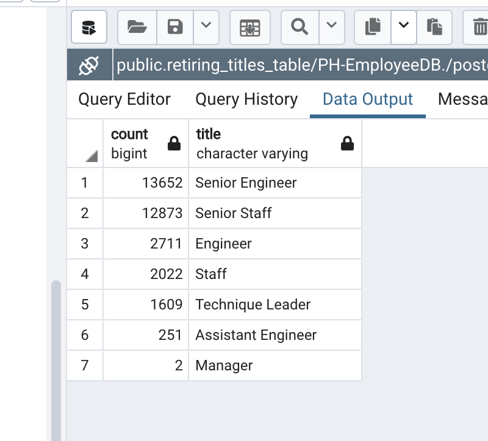
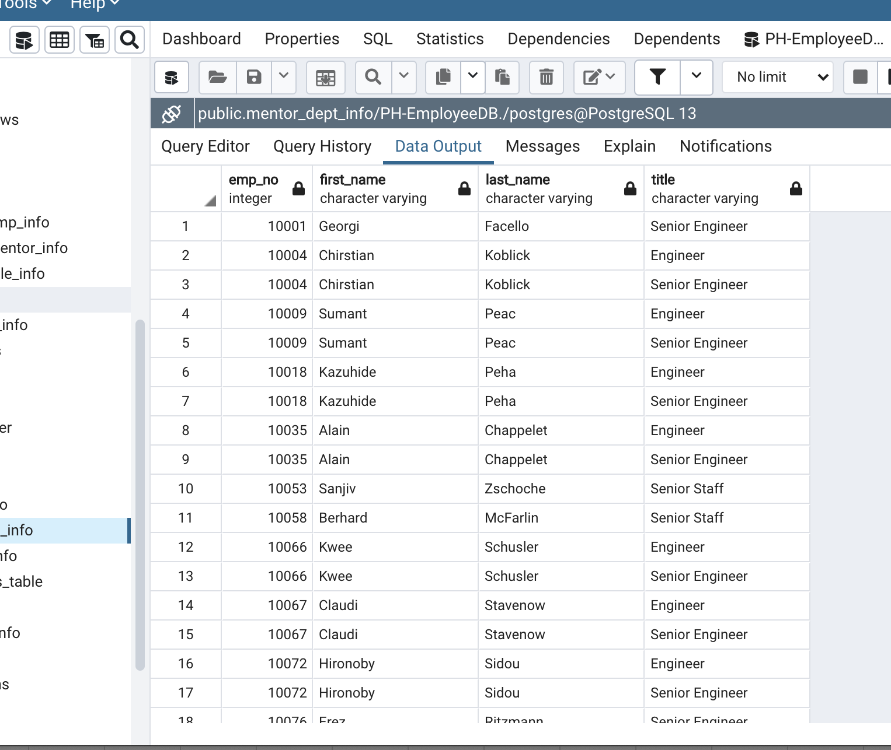
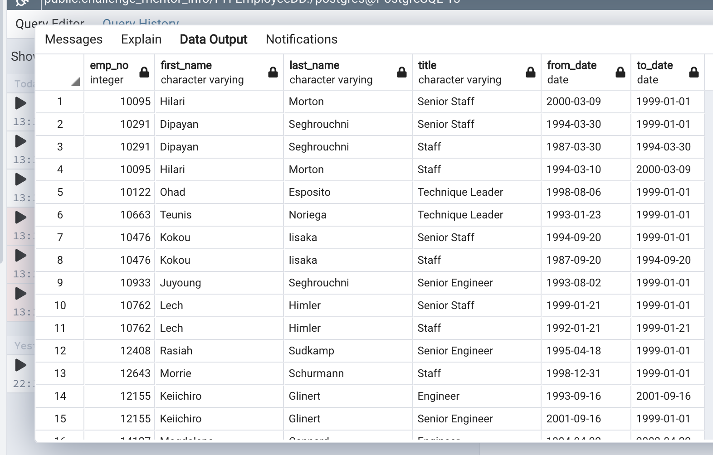

# Pewlett-Hackard-Analysis

# Background
### Now that Bobby has proven his SQL chops, his manager has given both of you two more assignments: determine the number of retiring employees per title, and identify employees who are eligible to participate in a mentorship program. Then, you’ll write a report that summarizes your analysis and helps prepare Bobby’s manager for the “silver tsunami” as many current employees reach retirement age.

# Overview of Analysis
In this challenge, you will use advanced queries and joins to create a list of candidates for the mentorship program. To complete this task, you’ll use your knowledge of aliasing, filtering, and creating new tables.

# Results

### Number of Individuals Retiring: 41,380
### Number of Individuals available for the mentorship role: 1,549

# In Conclusion

